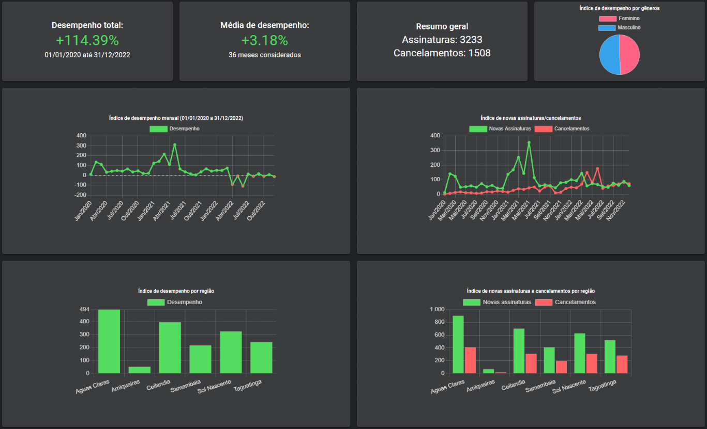

    <h1>Dashboard interativo utilizando React, Typescript e MaterialUI</h1>

  

## Sobre
Sistema para processamento e exibição de gráficos para auxílio a análise de dados e tomada de decisão. Nesse sistema é possível realizar um acompanhamento no número de crescimento, faturamentos, novas assinaturas e cancelamentos mensais/diários de uma empresa, além de fazer o comparativo de diferentes anos e meses.
O sistema foi desenvolvido para uma empresa de telecomunicações do Distrito Federal para o trabalho de conclusão de curso em Tecnologia em Sistemas para Internet.

## Tecnologias utilizadas
* React v18.2.0
* MaterialUI
* Typescript v4.9.5
* JavaScript
* Node.js v16.17.1
* Express v4.18.2
* Python
* MySQL

## Inicialização e uso
Em breve